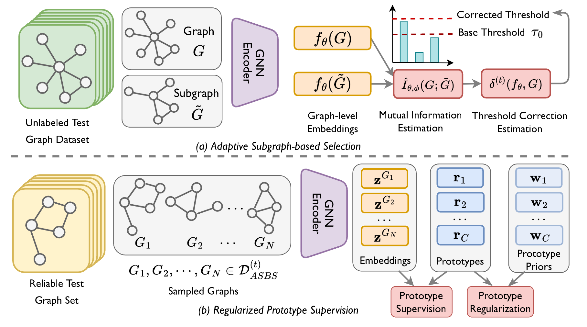

# Code for paper: "Test-time Adaptation on Graphs via Adaptive Subgraph-based Selection and Regularized Prototypes" accepted by ICML 2025

## About the Paper

Paper Link: [[PDF]](https://openreview.net/pdf?id=lC40m2jjUO)

### TL;DR

This paper explores a novel yet under-explored problem of test-time adaptation on graphs and proposes a novel method named Adaptive Subgraph-based Selection and Regularized Prototype Supervision (ASSESS) to solve the problem.

### Abstract

Test-time adaptation aims to adapt a well-trained model using test data only, without accessing training data. It is a crucial topic in machine learning, enabling a wide range of applications in the real world, especially when it comes to data privacy. While existing works on test-time adaptation primarily focus on Euclidean data, research on non-Euclidean graph data remains scarce. Prevalent graph neural network methods could encounter serious performance degradation in the face of test-time domain shifts. In this work, we propose a novel method named Adaptive Subgraph-based Selection and Regularized Prototype Supervision (ASSESS) for reliable test-time adaptation on graphs. Specifically, to achieve flexible selection of reliable test graphs, ASSESS adopts an adaptive selection strategy based on fine-grained individual-level subgraph mutual information. Moreover, to utilize the information from both training and test graphs, ASSESS constructs semantic prototypes from the well-trained model as prior knowledge from the unknown training graphs and optimizes the posterior given the unlabeled test graphs. We also provide a theoretical analysis of the proposed algorithm. Extensive experiments verify the effectiveness of ASSESS against various baselines.

### Method Framework



The overall framework of the proposed method. We first select reliable test graphs in the unlabeled test graph dataset using adaptive subgraph-based selection (ASBS), where we utilize mutual information to generate structure-aware, individual-level thresholds. Subsequently, we utilize these graphs for self-training with regularized prototype supervision (RPS), where the prototypes are regularized by prior knowledge and used for supervising the learned embedding of test graphs.

## About the Code

### Major Requirements

- python >= 3.10
- pytorch >= 1.12
- scikit-learn >= 1.1
- torch-cluster >= 1.6
- torch-scatter >= 2.0
- torch-sparse >= 0.6
- numpy >= 1.23
- loguru >= 0.6

### How to Run

```bash
python main.py --dataset FRANKENSTEIN --log_dir /path/to/log/dir --num_workers 8 --source_index the_source_index --target_index the_target_index ...
```